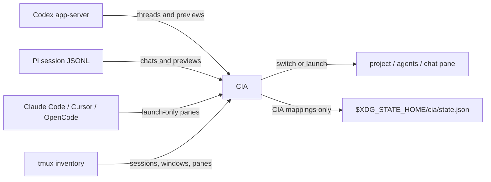

<div align="center">

<h1>🕵️ CIA</h1>
<h3>Your agent chats, live panes, and projects in one tmux-native dashboard.</h3>

<p>
  <a href="https://github.com/vivek-x-jha/cia"></a>
  <a href="https://www.rust-lang.org/"></a>
  <a href="https://ratatui.rs/"></a>
  <a href="LICENSE"></a>
</p>

<p><strong>Browse history. Preview context. Resume exactly where you stopped.</strong></p>

</div>

CIA is a fast terminal dashboard for people who run multiple coding-agent
conversations across tmux projects. It reads saved Codex threads through
`codex app-server`, reads saved Pi chats from Pi's session JSONL files, and
switches or launches managed Codex, Pi, Claude Code, Cursor, and OpenCode panes through
tmux.

It does not replace Codex, Pi, Claude Code, Cursor, OpenCode, or tmux. It connects them.

> CIA is an independent project and is not affiliated with or endorsed by
> OpenAI.

## Highlights

- **Project-first navigation** across saved Codex/Pi chats and live tmux agents.
- **Transcript previews** showing the latest user and agent messages before you
  resume a chat.
- **Direct switching** to an existing live pane without starting another
  process.
- **Named new chats** created in the selected project for Pi, Claude Code, Codex, Cursor, or OpenCode.
- **One `agents` window per project**, with each managed chat in its own pane.
- **tmux-resurrect support** that preserves the command needed to reopen a
  specific thread.
- **Harness-aware tmux metadata** so panes are tagged by agent harness and
  saved thread id.
- **Read-only history integration** through `codex app-server` and Pi session
  JSONL files; CIA never edits agent-owned history.
- **Launch-only support** for Claude Code, Cursor, and OpenCode panes.
- **Small, inspectable state** containing only CIA's pane mappings, selected
  project, hidden projects, and local archive flags.

## Requirements

- [Codex CLI](https://developers.openai.com/codex/cli/) with `app-server`
  support
- [Pi](https://pi.dev/) for Pi chat history and launches
- Optional: Claude Code (`claude`), Cursor (`cursor`), or OpenCode (`opencode`) for launch-only panes
- [tmux](https://github.com/tmux/tmux)
- A true-color terminal
- Rust and Cargo for source installation

CIA targets Unix-like systems where your configured agents and tmux are available.
It is developed and tested on macOS.

## Installation

Install the latest release directly from GitHub:

```sh
cargo install --locked --git https://github.com/vivek-x-jha/cia
```

Or install a local checkout:

```sh
git clone https://github.com/vivek-x-jha/cia.git
cargo install --locked --path cia
```

Verify the installation:

```sh
cia --version
```

## Quick Start

Run CIA from any shell:

```sh
cia
```

Preselect the project matching a working directory:

```sh
cia --project "$PWD"
```

Open an existing thread directly by name, title, or preview text:

```sh
cia open "thread name"
cia --project /path/to/project open "partial title"
cia open --archived "old thread"
cia open --harness pi "daily driver task"
```

For a tmux-native launcher, add a popup binding:

```tmux
bind g display-popup -E -w '95%' -h '95%' \
  -d '#{pane_current_path}' 'cia --project "$PWD"'
```

Reload tmux, then open CIA with `prefix + g`.

## Keyboard Reference

| Key | Action |
| --- | --- |
| `Tab`, `Shift-Tab`, `h`, `l`, `←`, `→` | Move focus between projects, chats, and preview |
| `j`, `Ctrl+n`, `↓` | Move selection down |
| `k`, `Ctrl+p`, `↑` | Move selection up |
| `Ctrl+d`, `Ctrl+u` | Scroll the preview down or up |
| `gg`, `G` | Jump to the first or last selection |
| `Enter` | Switch to a live chat or resume a saved thread |
| `N` | Enter a path or bare name and add/create a new project in CIA |
| `n` | Pick a harness (Pi, Claude Code, Codex, Cursor, OpenCode), then name and start a new chat in the selected project |
| `/` | Search projects and chats |
| `a` | Toggle between unarchived chats and all chats |
| `A` | Archive the selected saved chat |
| `U` | Unarchive the selected saved chat |
| `D` | Hide or delete the focused project folder, or delete the selected chat history file(s) |
| `r` | Refresh agent and tmux state |
| `?` | Toggle help |
| `q`, `Esc` | Close CIA |

## Mouse Reference

- Click a project or chat to select it.
- Double-click a project to move focus to its chats.
- Double-click a chat to switch to its live pane or resume it.
- Scroll inside the TUI to move the preview.
- Click top status bar actions for help, search, open, all/current, new project,
  new chat, archive/unarchive, and delete.
- Click a new-chat harness option or a delete confirmation button when those
  prompts are open.

The top status bar mirrors these actions with clickable text segments. The left
side shows project/thread counts plus help and search. The right side shows open,
all/current, new project, new chat, archive/unarchive, and delete. Segment colors are configurable
under `[theme]`; harness icons are configurable under each harness section and
are shown in the chats list, preview role labels, and new-chat picker. Harness
icon colors in chats, previews, and the new-chat picker share the
`theme.new_chat_*` harness color settings.
The new-chat harness picker is ordered alphabetically by harness label: Claude Code, Codex, Cursor, OpenCode, Pi. The default selected harness is configurable and defaults to Pi.

## How Sessions Work

CIA merges two sources of truth:

1. `codex app-server` supplies Codex projects, saved threads, metadata, and
   transcript previews.
2. Pi session JSONL files under `$PI_CODING_AGENT_DIR/sessions` supply Pi
   saved chats and previews.
3. Claude Code, Cursor, and OpenCode are launch-only harnesses: CIA can start and switch
   their managed panes, but does not read saved history for them.
4. tmux supplies live sessions, windows, panes, commands, and working
   directories.

Selecting a saved thread creates or reuses an `agents` window in the matching
project session, starts the thread in a dedicated pane, records pane-local
metadata, selects that pane, and zooms it. Selecting an already-live thread
switches directly to its pane.



CIA never guesses a relationship between an arbitrary agent process and a
saved chat. A pre-existing process without reliable metadata appears as an
**unmapped live agent** only when it has no thread title metadata. Unmanaged
shell panes are ignored, even inside a window named `agents`.

Newly named chats have one Codex edge case: an empty thread is omitted from
Codex's normal thread list until its first user message. During that short
period CIA may show the titled pane as a live agent; after the first message it
links to the saved thread normally.

## tmux-resurrect

CIA launches managed panes through a hidden `cia run-thread` command. That
wrapper keeps the thread ID, project directory, agent command, and stable title
visible to tmux-resurrect while the agent runs as its child process.

Add the wrapper to your existing restore list:

```tmux
set -g @resurrect-processes '\
  "~cia run-thread" \
'
```

If you already maintain `@resurrect-processes`, add only the quoted
`"~cia run-thread"` entry. Make a fresh Resurrect save after opening chats
through CIA.

On restore, existing Codex and Pi chats resume by harness-native id. A
CIA-created Codex chat can resume by its stable Codex name once Codex has
recorded its first message; Pi chats resume through `pi --session`, plus
`--session-dir` when `pi.session_dir` is configured. Launch-only Claude Code and
Cursor and OpenCode panes restore by restarting the configured command in the saved project
pane with CIA metadata intact.

## Configuration

CIA reads an optional TOML file from:

```text
$XDG_CONFIG_HOME/cia/config.toml
```

Without `XDG_CONFIG_HOME`, the path defaults to `~/.config/cia/config.toml`.
The file is optional. Every section and every key is optional; omitted values
use built-in defaults. Values such as `$RED_HEX` in the example below are expanded from the environment when CIA loads.

```toml
[codex]
command = "codex"
icon = "󱙺"
label = "Codex"
transcript_turns = 3

[pi]
command = "pi"
icon = "π"
label = "Pi"
# session_dir = "/custom/pi/sessions"
# enabled = true

[claude]
command = "claude"
icon = ""
label = "Claude Code"
# enabled = true

[cursor]
command = "cursor"
icon = "󰋙"
label = "Cursor"
# enabled = true

[opencode]
command = "opencode"
icon = ""
label = "OpenCode"
# enabled = true

[tmux]
command = "tmux"
agent_commands = ["pi", "claude", "codex", "cursor", "opencode"]
agent_window_names = ["agents"]
new_window_prefix = "agent:"

[ui]
archived_default = false
archive_icon = ""
default_harness = "pi"

[theme]
background = "#101218"
surface = "#1b1e28"
foreground = "#e6e6e6"
muted = "#747b8c"
accent = "#a8c7fa"
selected = "#30364a"
success = "#9bd5a5"
warning = "#e5c07b"
error = "$BRIGHTRED_HEX"
title_focused = "#d2fd9d"
title_unfocused = "#5c617d"
border_focused = "#000000"
border_unfocused = "#5c617d"
status_projects = "#e6e6e6"
status_threads = "#000000"
status_open = "#80d7fe"
status_new = "#80d7fe"
status_new_chat = "#9bd5a5"
status_search = "#0000ff"
status_archive = "#e06c75"
status_archive_action = "#e06c75"
status_unarchive = "#c678dd"
status_delete = "#e06c75"
archive_icon = "$RED_HEX"
status_help = "#e5c07b"
preview_user = "#0000ff"
preview_codex = "#00ffff"
preview_pi = "$MAGENTA_HEX"
preview_text = "#e6e6e6"
preview_title = "$CYAN_HEX"
new_chat_unfocused = "$BRIGHTBLACK_HEX"
new_chat_pi = "$MAGENTA_HEX"
new_chat_claude = "$BRIGHTYELLOW_HEX"
new_chat_codex = "$BRIGHTMAGENTA_HEX"
new_chat_cursor = "$BLACK_HEX"
new_chat_opencode = "$WHITE_HEX"
new_chat_path = "$BLUE_HEX"
new_chat_executable = "$BRIGHTGREEN_HEX"
```

Unknown keys are rejected so misspellings and stale configuration fail loudly.
String values support `$VAR` and `${VAR}` environment expansion when CIA loads
configuration. Theme values are six-digit RGB colors after expansion. Harness
icon values are plain strings, so you can replace them with ASCII if your
terminal font lacks a glyph. Harness labels are plain strings too, so the
new-chat text segments are customizable from config. The new-chat harness picker
is vertical and includes a CLI path column resolved with `command -v` for each
harness; missing CLI tools display `-` and selecting them shows a not-found error. Harness icon/label colors come from `theme.new_chat_*`, including unfocused rows; the CLI path column uses the unfocused/path/executable colors. This includes `ui.archive_icon`, the glyph shown beside archived chats. You can override only
the colors, icons, labels, and commands you care about; unset keys continue
using the defaults above.

### Configuration reference

| Key | Purpose |
| --- | --- |
| `codex.command` | Codex executable or wrapper used for app-server and chats; default `codex` |
| `codex.icon` | Icon shown in new-chat harness picker and previews; default `󱙺` |
| `codex.label` | Label shown in harness text segments; default `Codex` |
| `codex.transcript_turns` | Number of recent turns included in the preview |
| `pi.command` | Pi executable or wrapper used for Pi chats; default `pi` |
| `pi.icon` | Icon shown in new-chat harness picker and previews; default `π` |
| `pi.label` | Label shown in harness text segments; default `Pi` |
| New-chat harness order | Harness text segments are shown alphabetically as Claude Code, Codex, Cursor, OpenCode, Pi unless explicitly disabled |
| `pi.session_dir` | Optional override for Pi session lookup; defaults to `$PI_CODING_AGENT_SESSION_DIR`, then `$PI_CODING_AGENT_DIR/sessions`, then `~/.pi/agent/sessions` |
| `pi.enabled` | Optional explicit Pi enable/disable; by default Pi is shown even when `pi` is missing from `$PATH` |
| `claude.command` | Claude Code executable or wrapper used for launch-only panes; default `claude` |
| `claude.icon` | Icon shown in the new-chat harness picker; default `` |
| `claude.label` | Label shown in harness text segments; default `Claude Code` |
| `claude.enabled` | Optional explicit Claude Code enable/disable; by default shown even when `claude.command` is missing from `$PATH` |
| `cursor.command` | Cursor executable or wrapper used for launch-only panes; default `cursor` |
| `cursor.icon` | Icon shown in the new-chat harness picker; default `󰋙` |
| `cursor.label` | Label shown in harness text segments; default `Cursor` |
| `cursor.enabled` | Optional explicit Cursor enable/disable; by default shown even when `cursor.command` is missing from `$PATH` |
| `opencode.command` | OpenCode executable or wrapper used for launch-only panes; default `opencode` |
| `opencode.icon` | Icon shown in the new-chat harness picker; default `` |
| `opencode.label` | Label shown in harness text segments; default `OpenCode` |
| `opencode.enabled` | Optional explicit OpenCode enable/disable; by default shown even when `opencode.command` is missing from `$PATH` |
| `tmux.command` | tmux executable or wrapper |
| `tmux.agent_commands` | Process names treated as live agent panes; default `["pi", "claude", "codex", "cursor", "opencode"]` |
| `tmux.agent_window_names` | Candidate managed-window names; the first name is used for new and resumed chats |
| `tmux.new_window_prefix` | Legacy managed-window prefix retained for compatibility |
| `ui.archived_default` | Show all chats, including archived chats, when CIA starts |
| `ui.archive_icon` | Icon shown beside archived chats in all-chats view; default `` |
| `ui.default_harness` | Harness id initially selected in the new-chat harness picker; default `pi` |
| `theme.background`, `theme.surface` | Legacy surface colors retained for configuration compatibility |
| `theme.foreground`, `theme.muted`, `theme.accent`, `theme.selected`, `theme.success`, `theme.warning`, `theme.error` | Base TUI colors; status errors use `theme.error`, default `$BRIGHTRED_HEX` |
| `theme.title_focused`, `theme.title_unfocused` | Focused and unfocused pane title colors; defaults match tmux bright green (`#d2fd9d`) and bright black (`#5c617d`) |
| `theme.border_focused`, `theme.border_unfocused` | Focused and unfocused pane border colors; defaults are black (`#000000`) and bright black (`#5c617d`) |
| `theme.status_projects`, `theme.status_threads` | Project/thread count colors in the top status bar |
| `theme.status_open`, `theme.status_new`, `theme.status_new_chat`, `theme.status_search`, `theme.status_archive`, `theme.status_archive_action`, `theme.status_unarchive`, `theme.status_delete`, `theme.status_help` | Clickable action segment colors in the top status bar |
| `theme.archive_icon` | Color for archived-chat icon in all-chats view; default red (`#ff0000`); can be set to `$RED_HEX` |
| `theme.preview_user` | User role label color in the preview pane |
| `theme.preview_codex`, `theme.preview_pi` | Legacy preview role colors retained for configuration compatibility; harness role icons use the `theme.new_chat_*` harness colors |
| `theme.preview_text` | User and harness message text color in the preview pane |
| `theme.preview_title` | Selected chat title color at the top of the preview pane; default `$CYAN_HEX` |
| `theme.new_chat_unfocused` | New-chat harness picker foreground color for unfocused choices; default `$BRIGHTBLACK_HEX` |
| `theme.new_chat_pi`, `theme.new_chat_claude`, `theme.new_chat_codex`, `theme.new_chat_cursor`, `theme.new_chat_opencode` | Harness icon and new-chat picker foreground colors; defaults use `$MAGENTA_HEX`, `$BRIGHTYELLOW_HEX`, `$BRIGHTMAGENTA_HEX`, `$BLACK_HEX`, and `$WHITE_HEX` |
| `theme.new_chat_path`, `theme.new_chat_executable` | Focused CLI path colors in the new-chat harness picker; defaults use `$BLUE_HEX` for the path and `$BRIGHTGREEN_HEX` for the executable name |

## Data and Safety

CIA writes only:

```text
$XDG_STATE_HOME/cia/state.json
```

Without `XDG_STATE_HOME`, this becomes `~/.local/state/cia/state.json`.

The file contains the last selected project, CIA's tmux pane mappings, and CIA's
local archived-chat set. Archive and unarchive only update this CIA state; `a`
simply toggles whether those locally archived chats are included in the lists.
When all chats are shown, archived chats are marked with an archive icon.
`N` stores manually added project paths in CIA state and creates the directory if
needed. A bare project name (no path separators) is created under
`$XDG_STATE_HOME/cia/<name>` (or `~/.local/state/cia/<name>` when
`XDG_STATE_HOME` is unset). For projects, `D` offers both Hide (remove from
CIA's project view only) and Delete (remove the project directory from disk).
Chat delete removes the selected chat's known on-disk history file(s) directly.

## Architecture

The codebase is intentionally small and split by responsibility:

| Module | Responsibility |
| --- | --- |
| `agent` | Shared harness registry and thread/message model, including launch-only Claude Code, Cursor, and OpenCode adapters |
| `codex` | Codex JSONL app-server adapter, thread listing, and transcript extraction |
| `pi` | Pi session JSONL adapter, chat listing, and transcript extraction |
| `tmux` | Pane inventory, agent detection, launch, switching, and metadata |
| `model` | Project grouping and saved-thread/live-pane reconciliation |
| `state` | Durable CIA-only mapping state |
| `ui` | Ratatui rendering, navigation, search, and new-chat prompt |
| `runner` | Restore-safe encoding for hidden wrapper arguments |

## Development

```sh
git clone https://github.com/vivek-x-jha/cia.git
cd cia

cargo fmt --check
cargo test
cargo clippy --all-targets -- -D warnings
cargo run
```

On systems using this dotfiles setup, run these through `zsh -lc` so
`~/.zshenv` and `~/.dotfiles/shells/env` publish the expected Cargo, Codex, and
Pi paths. The test suite includes fake Codex app-server coverage, Pi JSONL
coverage, and an isolated tmux server integration test. Running the complete
suite therefore requires `tmux` on `PATH`.

## License

[MIT](LICENSE) © 2026 Vivek Jha
