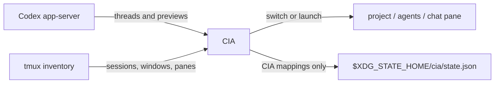

<div align="center">

<h1>CIA</h1>
<h3>Your Codex threads, live agents, and projects in one tmux-native dashboard.</h3>

<p>
  <a href="https://github.com/vivek-x-jha/cia"></a>
  <a href="https://www.rust-lang.org/"></a>
  <a href="https://ratatui.rs/"></a>
  <a href="LICENSE"></a>
</p>

<p><strong>Browse history. Preview context. Resume exactly where you stopped.</strong></p>

</div>

CIA is a fast terminal dashboard for people who run multiple coding-agent
conversations across tmux projects. Today its saved-history adapter is Codex,
and its tmux integration can also recognize other live agent commands when they
are listed in configuration.

It does not replace Codex or tmux. It connects them.

> CIA is an independent project and is not affiliated with or endorsed by
> OpenAI.

## Highlights

- **Project-first navigation** across saved Codex threads and live tmux agents.
- **Transcript previews** showing the latest user and agent messages before you
  resume a chat.
- **Direct switching** to an existing live pane without starting another
  process.
- **Named new chats** created in the selected project and renamed inside Codex.
- **One `agents` window per project**, with each managed chat in its own pane.
- **tmux-resurrect support** that preserves the command needed to reopen a
  specific thread.
- **Harness-aware tmux metadata** so panes are tagged by agent harness and
  saved thread id.
- **Read-only Codex history integration** through `codex app-server`; CIA never
  edits Codex databases or rollout files.
- **Small, inspectable state** containing only CIA's pane-to-thread mappings and
  last selected project.

## Requirements

- [Codex CLI](https://developers.openai.com/codex/cli/) with `app-server`
  support
- [tmux](https://github.com/tmux/tmux)
- A true-color terminal
- Rust and Cargo for source installation

CIA targets Unix-like systems where Codex and tmux are available. It is
developed and tested on macOS.

## Installation

Install the latest release directly from GitHub:

```sh
cargo install --locked --git https://github.com/vivek-x-jha/cia
```

Or install a local checkout:

```sh
git clone https://github.com/vivek-x-jha/cia.git
cargo install --locked --path cia
```

Verify the installation:

```sh
cia --version
```

## Quick Start

Run CIA from any shell:

```sh
cia
```

Preselect the project matching a working directory:

```sh
cia --project "$PWD"
```

Open an existing thread directly by name, title, or preview text:

```sh
cia open "thread name"
cia --project /path/to/project open "partial title"
cia open --archived "old thread"
```

For a tmux-native launcher, add a popup binding:

```tmux
bind g display-popup -E -w '95%' -h '95%' \
  -d '#{pane_current_path}' 'cia --project "$PWD"'
```

Reload tmux, then open CIA with `prefix + g`.

## Keyboard Reference

| Key | Action |
| --- | --- |
| `Tab`, `Shift-Tab`, `h`, `l` | Move focus between projects, chats, and preview |
| `j`, `Ctrl+n`, `↓` | Move selection down |
| `k`, `Ctrl+p`, `↑` | Move selection up |
| `Ctrl+d`, `Ctrl+u` | Scroll the preview down or up |
| `gg`, `G` | Jump to the first or last selection |
| `Enter` | Switch to a live chat or resume a saved thread |
| `n` | Name and start a new Codex chat in the selected project |
| `/` | Search projects and chats |
| `a` | Toggle archived threads |
| `r` | Refresh Codex and tmux state |
| `?` | Toggle help |
| `q`, `Esc` | Close CIA |

## How Sessions Work

CIA merges two sources of truth:

1. `codex app-server` supplies projects, saved threads, metadata, and transcript
   previews.
2. tmux supplies live sessions, windows, panes, commands, and working
   directories.

Selecting a saved thread creates or reuses an `agents` window in the matching
project session, starts the thread in a dedicated pane, records pane-local
metadata, selects that pane, and zooms it. Selecting an already-live thread
switches directly to its pane.



CIA never guesses a relationship between an arbitrary Codex process and a
saved thread. A pre-existing process without reliable metadata appears as an
**unmapped live agent**. Unmanaged shell panes are ignored, even inside a window
named `agents`.

Newly named chats have one Codex edge case: an empty thread is omitted from
Codex's normal thread list until its first user message. During that short
period CIA may show the titled pane as a live agent; after the first message it
links to the saved thread normally.

## tmux-resurrect

CIA launches managed panes through a hidden `cia run-thread` command. That
wrapper keeps the thread ID, project directory, Codex command, and stable title
visible to tmux-resurrect while Codex runs as its child process.

Add the wrapper to your existing restore list:

```tmux
set -g @resurrect-processes '\
  "~cia run-thread" \
'
```

If you already maintain `@resurrect-processes`, add only the quoted
`"~cia run-thread"` entry. Make a fresh Resurrect save after opening chats
through CIA.

On restore, existing chats resume by UUID. A CIA-created named chat can resume
by its stable Codex name once Codex has recorded its first message.

## Configuration

CIA reads an optional TOML file from:

```text
$XDG_CONFIG_HOME/cia/config.toml
```

Without `XDG_CONFIG_HOME`, the path defaults to `~/.config/cia/config.toml`.
The file is optional. Every section and every key is optional; omitted values
use the built-in defaults below.

```toml
[codex]
command = "codex"
transcript_turns = 3

[tmux]
command = "tmux"
agent_commands = ["codex"]
agent_window_names = ["agents"]
new_window_prefix = "agent:"

[ui]
archived_default = false

[theme]
background = "#101218"
surface = "#1b1e28"
foreground = "#e6e6e6"
muted = "#747b8c"
accent = "#a8c7fa"
selected = "#30364a"
success = "#9bd5a5"
warning = "#e5c07b"
error = "#e06c75"
status_projects = "#e6e6e6"
status_threads = "#000000"
status_open = "#80d7fe"
status_new = "#9bd5a5"
status_search = "#0000ff"
status_archive = "#e06c75"
status_help = "#e5c07b"
preview_user = "#0000ff"
preview_codex = "#00ffff"
```

Unknown keys are rejected so misspellings and stale configuration fail loudly.
Theme values are six-digit RGB colors. You can override only the colors you
care about; unset theme keys continue using the defaults above.

### Configuration reference

| Key | Purpose |
| --- | --- |
| `codex.command` | Codex executable or wrapper used for app-server and chats |
| `codex.transcript_turns` | Number of recent turns included in the preview |
| `tmux.command` | tmux executable or wrapper |
| `tmux.agent_commands` | Process names treated as live agent panes, for example `["codex", "claude", "opencode", "pi"]` |
| `tmux.agent_window_names` | Candidate managed-window names; the first name is used for new and resumed chats |
| `tmux.new_window_prefix` | Legacy managed-window prefix retained for compatibility |
| `ui.archived_default` | Show archived threads when CIA starts |
| `theme.background`, `theme.surface` | Legacy surface colors retained for configuration compatibility |
| `theme.foreground`, `theme.muted`, `theme.accent`, `theme.selected`, `theme.success`, `theme.warning`, `theme.error` | Base TUI colors |
| `theme.status_projects`, `theme.status_threads` | Project/thread count and label colors in the top status bar |
| `theme.status_open`, `theme.status_new`, `theme.status_search`, `theme.status_archive`, `theme.status_help` | Action segment colors in the top status bar |
| `theme.preview_user`, `theme.preview_codex` | Role label colors in the preview pane |

## Data and Safety

CIA writes only:

```text
$XDG_STATE_HOME/cia/state.json
```

Without `XDG_STATE_HOME`, this becomes `~/.local/state/cia/state.json`.

The file contains the last selected project and CIA's tmux pane mappings. Each
mapping records a harness id plus the harness-native thread id. CIA
does **not** modify Codex's SQLite databases, rollout JSONL files, archived
threads, or authentication state. Thread creation, naming, and resume behavior
remain owned by the Codex CLI.

## Architecture

The codebase is intentionally small and split by responsibility:

| Module | Responsibility |
| --- | --- |
| `agent` | Shared harness-neutral thread/message model and client boundary |
| `codex` | Codex JSONL app-server adapter, thread listing, and transcript extraction |
| `tmux` | Pane inventory, agent detection, launch, switching, and metadata |
| `model` | Project grouping and saved-thread/live-pane reconciliation |
| `state` | Durable CIA-only mapping state |
| `ui` | Ratatui rendering, navigation, search, and new-chat prompt |
| `runner` | Restore-safe encoding for hidden wrapper arguments |

## Development

```sh
git clone https://github.com/vivek-x-jha/cia.git
cd cia

cargo fmt --check
cargo test
cargo clippy --all-targets -- -D warnings
cargo run
```

The test suite includes fake Codex app-server coverage and an isolated tmux
server integration test. Running the complete suite therefore requires `tmux`
on `PATH`.

## License

[MIT](LICENSE) © 2026 Vivek Jha
