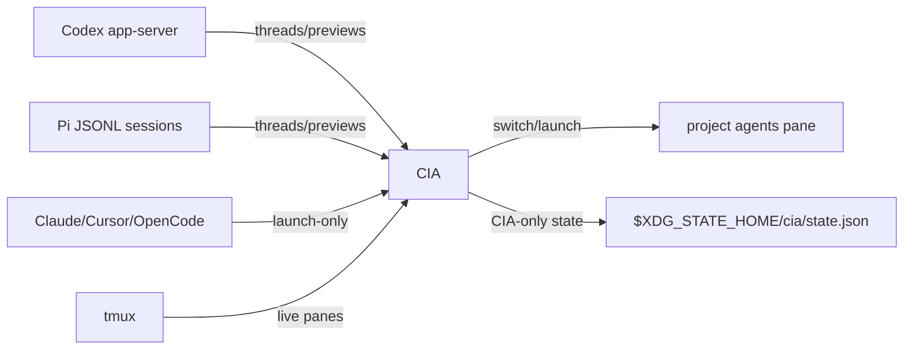

<div align="center">

# 🕵️ CIA

**A tmux-native dashboard for Codex, Pi, and other coding-agent chats.**

<p>
  <a href="https://github.com/vivek-x-jha/cia"></a>
  <a href="https://www.rust-lang.org/"></a>
  <a href="https://ratatui.rs/"></a>
  <a href="LICENSE"></a>
</p>

Browse history. Preview context. Resume exactly where you stopped.

</div>

CIA reads saved Codex/Pi chats and reconciles them with live tmux panes. It can
switch to an existing managed agent pane or launch a new one in the matching
project session. History integrations are read-only; CIA stores only its own tmux
pane mappings and local UI state.

> CIA is independent software and is not affiliated with or endorsed by OpenAI,
> Pi, Anthropic, Cursor, OpenCode, or tmux.

## ✨ Features

- 🗂️ **Project-first view** of saved chats and live agent panes.
- 🔎 **Search/open by name, title, or preview text** from the TUI or CLI.
- 👀 **Transcript preview** with recent user/agent turns.
- 📌 **Status pane** with harness icon, sessions folder, project, activity,
  thread id, archive state, timestamps, and context remaining when available.
- 🟢 **Live-pane detection** through tmux metadata; switch without duplicating agents.
- 🚀 **New named chats** for Pi, Claude Code, Codex, Cursor, and OpenCode.
- 🧭 **One `agents` window per project**, each chat in a dedicated pane.
- ♻️ **tmux-resurrect-friendly wrapper** for restoring managed chats.
- 🧰 **Launch-only support** for Claude Code, Cursor, and OpenCode.
- 🛡️ **Read-only Codex/Pi history adapters**; CIA never edits agent-owned history.

## 📦 Requirements

- Unix-like system with a true-color terminal
- [tmux](https://github.com/tmux/tmux)
- Rust/Cargo for source installation
- [Codex CLI](https://developers.openai.com/codex/cli/) with `app-server` support for Codex history
- [Pi](https://pi.dev/) for Pi history and launches
- Optional CLIs: `claude`, `cursor`, `opencode`

CIA is developed and tested on macOS.

## 🚀 Install

From GitHub:

```sh
cargo install --locked --git https://github.com/vivek-x-jha/cia
```

From a local checkout:

```sh
git clone https://github.com/vivek-x-jha/cia.git
cargo install --locked --path cia
```

Verify:

```sh
cia --version
```

## ⚡ Usage

Open the dashboard:

```sh
cia
```

Start focused on the current project:

```sh
cia --project "$PWD"
```

Open a saved thread directly:

```sh
cia open "thread name"
cia --project /path/to/project open "partial title"
cia open --archived "old thread"
cia open --harness pi "daily driver task"
```

Generate shell completions and write them to a directory loaded by your shell:

```sh
# Paths are examples; write to a directory loaded by your shell.
cia completions bash > ~/.dotfiles/shells/bash/cmps/cia.bash
cia completions zsh > "$ZDOTDIR/comps/_cia"
cia completions fish > "${XDG_CONFIG_HOME:-$HOME/.config}/fish/completions/cia.fish"
```

### tmux popup

```tmux
bind g display-popup -E -w '95%' -h '95%' \
  -d '#{pane_current_path}' 'cia --project "$PWD"'
```

Reload tmux and open with `prefix + g`.

## ⌨️ Controls

| Key | Action |
| --- | --- |
| `Tab`, `Shift-Tab`, `h`, `l`, `←`, `→` | Move focus between projects, chats, status, preview |
| `j`, `Ctrl+n`, `↓` | Move selection down, or scroll status when status is focused |
| `k`, `Ctrl+p`, `↑` | Move selection up, or scroll status when status is focused |
| `Ctrl+d`, `Ctrl+u` | Scroll focused status/preview pane |
| `gg`, `G` | Jump to first/last item |
| `Enter` | Switch to live pane or resume saved thread |
| `N` | Add/create a project path |
| `n` | Pick a harness and start a named chat |
| `/` | Search projects and chats |
| `a` | Toggle active/all chats |
| `A`, `U` | Archive/unarchive selected saved chat in CIA state |
| `D` | Hide/delete project or delete selected chat history file(s) and matching live pane |
| `r` | Refresh |
| `?` | Help |
| `q`, `Esc` | Quit |

Mouse support:

- Click project/chat/status/preview to focus.
- Double-click project to focus chats.
- Double-click chat to open/resume.
- Scroll over status or preview to scroll that pane.
- Click top-bar actions for help/search/open/all/new/archive/delete.

## 🧠 How it works

CIA merges four read-only/runtime sources:

1. `codex app-server` for Codex saved threads and previews.
2. Pi session JSONL files for Pi saved chats and previews.
3. tmux pane inventory for live processes, cwd, pane ids, and CIA metadata.
4. CIA state for pane mappings, hidden projects, selected project, and local archive flags.



CIA does not guess arbitrary agent/thread relationships. A live process without
reliable metadata appears as an unmapped live agent; unmanaged shells are ignored.

## ♻️ tmux-resurrect

CIA launches managed panes through a hidden restore-safe wrapper:

```text
cia run-thread ...
```

Add it to tmux-resurrect:

```tmux
set -g @resurrect-processes '\
  "~cia run-thread" \
'
```

Then open chats through CIA and make a fresh Resurrect save.

## ⚙️ Configuration

CIA reads optional TOML from:

```text
$XDG_CONFIG_HOME/cia/config.toml
```

Fallback path: `~/.config/cia/config.toml`. Every key is optional; unknown keys
are rejected. Environment variables such as `$BLUE_HEX` are expanded when CIA
loads config.

Minimal example:

```toml
[ui]
default_harness = "pi"
archived_default = false
archive_icon = ""

[codex]
command = "codex"
icon = "󱙺"
label = "Codex"
transcript_turns = 3

[pi]
command = "pi"
icon = "π"
label = "Pi"
# session_dir = "/custom/pi/sessions"
# enabled = true

[tmux]
command = "tmux"
agent_commands = ["pi", "claude", "codex", "cursor", "opencode"]
agent_window_names = ["agents"]
new_window_prefix = "agent:"
```

Theme defaults:

```toml
[theme]
background = ""          # legacy; CIA leaves terminal/popup background transparent
surface = ""             # legacy; panels do not paint a fixed background
foreground = "#e6e6e6"
muted = "#747b8c"
accent = "#a8c7fa"
selected = "#30364a"
success = "#9bd5a5"
live = "$BRIGHTGREEN_HEX"
inactive = "$BRIGHTBLACK_HEX"
warning = "#e5c07b"
error = "$BRIGHTRED_HEX"
title_focused = "#d2fd9d"
title_unfocused = "#5c617d"
border_focused = "#000000"
border_unfocused = "#5c617d"
status_projects = "#e6e6e6"
status_threads = "#000000"
status_open = "#80d7fe"
status_new = "#80d7fe"
status_new_chat = "#9bd5a5"
status_search = "#0000ff"
status_archive = "#e06c75"
status_archive_action = "#e06c75"
status_unarchive = "#c678dd"
status_delete = "#e06c75"
status_help = "#e5c07b"
archive_icon = "$RED_HEX"
status_key = "$WHITE_HEX"
status_sessions = "$BLUE_HEX"
status_project = "$BLUE_HEX"
status_thread_name = "$YELLOW_HEX"
status_thread_id = "$BRIGHTYELLOW_HEX"
status_context = "$CYAN_HEX"      # also used for Archived: no
status_archived = "$RED_HEX"      # Archived: yes
status_timestamp = "$BLACK_HEX"   # Created
status_updated = "$BRIGHTMAGENTA_HEX"
preview_user = "#0000ff"
preview_codex = "#00ffff"         # legacy compatibility
preview_pi = "$MAGENTA_HEX"       # legacy compatibility
preview_text = "#e6e6e6"
preview_title = "$CYAN_HEX"       # legacy compatibility
preview_metadata_key = "$WHITE_HEX"
preview_metadata_thread = "$YELLOW_HEX"
preview_metadata_context = "$GREEN_HEX"
preview_metadata_date = "$BRIGHTMAGENTA_HEX"
preview_metadata_path = "$BLUE_HEX"
new_chat_unfocused = "$BRIGHTBLACK_HEX"
new_chat_pi = "$MAGENTA_HEX"
new_chat_claude = "$BRIGHTYELLOW_HEX"
new_chat_codex = "$BRIGHTBLUE_HEX"
new_chat_cursor = "$BLACK_HEX"
new_chat_opencode = "$WHITE_HEX"
new_chat_path = "$BLUE_HEX"
new_chat_executable = "$BRIGHTGREEN_HEX"
```

Harness sections:

| Key | Purpose |
| --- | --- |
| `codex.command`, `pi.command`, `claude.command`, `cursor.command`, `opencode.command` | CLI executable/wrapper |
| `*.icon` | Icon shown in chat lists, status, previews, and new-chat picker |
| `*.label` | Human label in prompts |
| `*.enabled` | Optional enable/disable for Pi and launch-only harnesses |
| `codex.transcript_turns` | Recent turns shown in preview |
| `pi.session_dir` | Pi sessions folder; defaults to `$PI_CODING_AGENT_SESSION_DIR`, then `$PI_CODING_AGENT_DIR/sessions`, then `~/.pi/agent/sessions` |

Theme notes:

- Harness colors use `theme.new_chat_*` everywhere icons are shown.
- `theme.status_*` controls Status pane values.
- `theme.preview_metadata_*` keys are retained for compatibility with older configs.
- `theme.background` and `theme.surface` are legacy no-op compatibility keys.

## 🗄️ Data and safety

CIA writes only:

```text
$XDG_STATE_HOME/cia/state.json
```

Fallback path: `~/.local/state/cia/state.json`.

This state contains CIA pane mappings, hidden projects, selected project, and
local archive flags. Delete actions are explicit: project delete removes a
project directory; chat delete removes known chat history file(s) and matching
live tmux pane. CIA never mutates Codex/Pi history as part of listing or preview.

## 🧱 Architecture

| Module | Responsibility |
| --- | --- |
| `agent` | Shared harness/thread/message model |
| `codex` | Codex app-server adapter and JSONL transcript parsing |
| `pi` | Pi session JSONL adapter |
| `tmux` | Pane inventory, launch, switch, metadata |
| `model` | Project grouping and live/saved reconciliation |
| `state` | CIA-owned durable state |
| `ui` | Ratatui rendering and input |
| `runner` | tmux-resurrect-safe wrapper argument encoding |

## 🛠️ Development

```sh
git clone https://github.com/vivek-x-jha/cia.git
cd cia

cargo fmt --check
cargo test
cargo clippy --all-targets -- -D warnings
cargo run
```

On this development machine, run checks through `zsh -lc` so shell-managed PATH
and environment variables are loaded. The test suite includes fake Codex
app-server coverage, Pi JSONL coverage, and an isolated tmux integration test.

## 📝 Notes

See [`project-notes.md`](project-notes.md) for deferred provider-specific work,
including live usage-limit/status parity with harness CLIs.

## License

[MIT](LICENSE) © 2026 Vivek Jha
